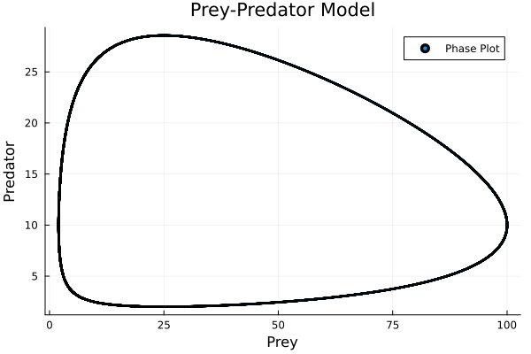

# Final Homework

## 2. (20pts) Ch 5. Computer problems. p 253. 5.23, 5.24, and an extra problem similar to 5.24 — Derive the equations similar to the problem 5.24 of the book for n = 3 and solve it to find points and weight for Gaussian quadrature. In other words, write down 6 equations in 6 unknowns $(w_i, x_i), i \in \{1, 2, 3\}$.

### 5.23 (10pts)

Need to correctly implement Newton's method. (See `5_23.jl`.)

Solution: $(0.877965760274447, 0.6767569705180311, 1.3308554116211024)$.

Superlinear convergence:


### 5.24 (5pts)

At least two: $(x_1, x_2) = (\pm x, \mp x)$ with $w_1 = w_2 = 1$, by looking at the second and the fourth equations.

See `5_24.jl` for a reference.

### 5.24 (Extra) (5pts)

For $n = 3$, we have the following equations:

$$
\int_{-1}^{1} x^d dx = \sum_{i=1}^{3} w_i x_i^d,
$$

where $d \in \{0, 1, 2, 3, 4, 5\}$.

Due to the symmetry, there are at least 6 solutions.
For example, $x_1 = 0$, $(x_2, x_3) = (\pm x, \mp x)$.

See `5_24_extra.jl` for a reference.

```shell
w: [0.8888888888890178, 0.5555555555554912, 0.5555555555554912]
x: [1.3195414406293998e-17, -0.7745966692415411, 0.7745966692415411]
```

## 3. (15pts) Ch 5. Computer problems. 5.27(a), (b), (e)

See `5_27.jl` for a reference.

Here, presenting the results is not important.
The important thing is to investigate potential problems and try to explain why they occur.
No points will be given for the mere presentation of the results.

### (a) (5pts)

Newton's method converges to the root $(5, 4)$ after 43 iterations.
Initial guess $(15, -2)$ was far from the root $(5, 4)$. This may cause the slow convergence.

```shell
----            -------------           -----------             -------             
Iter            f(u) inf-norm           Step 2-norm             cond(J)             
----            -------------           -----------             -------             
0               3.40000000e+01          1.51327460e+01          4.26193936e+01      
10              3.21102942e+01          1.51327460e+01          4.26193936e+01      
20              4.25261726e+01          1.51327460e+01          4.26193936e+01      
30              1.47804541e+01          1.51327460e+01          4.26193936e+01      
40              1.26234669e-01          1.51327460e+01          4.26193936e+01      
43              0.00000000e+00          1.51327460e+01          4.26193936e+01      
Final           0.00000000e+00      
----------------------      
Solution: [4.999999999999999, 4.0]
Residual: [0.0, 0.0]
```

### (b) (5pts)

Newton's method stops right after the first descent step.
Especially, the residual for $x_3$ is big.
We compute the condition number of the Jacobian matrix at initial value, which results in $6 \times 10^{16}$, indicating that the linearization near the initial guess might be problematic.

```shell
----            -------------           -----------             -------             
Iter            f(u) inf-norm           Step 2-norm             cond(J)             
----            -------------           -----------             -------             
0               9.80762114e-02          2.23606798e+00          6.00327802e+16      
1               9.80762114e-02          2.23606798e+00          6.00327802e+16      
Final           9.80762114e-02      
----------------------      
Solution: [1.3660254037844386, -0.3660254037844386, 1.7320508075688772]
Residual: [0.0, 0.0, 0.09807621135331601]
Condition number of the Jacobian matrix at x₀: 6.003278024928539e16
```

### (e) (5pts)

There is an overshooting (see Iter 5 -> Iter 6).
```shell
----            -------------           -----------             -------             
Iter            f(u) inf-norm           Step 2-norm             cond(J)             
----            -------------           -----------             -------             
0               1.00000000e+00          1.00000000e+00          2.71828186e+04      
1               9.99456344e-01          1.00000000e+00          2.71828186e+04      
2               9.98891952e-01          1.00000000e+00          2.71828186e+04      
3               3.32092868e-01          1.00000000e+00          2.71828186e+04      
4               1.64942813e-01          1.00000000e+00          2.71828186e+04      
5               2.43100278e-03          1.00000000e+00          2.71828186e+04      
6               2.55964152e-02          1.00000000e+00          2.71828186e+04      
7               1.26343681e-02          1.00000000e+00          2.71828186e+04      
8               7.30875707e-03          1.00000000e+00          2.71828186e+04      
9               2.18670063e-03          1.00000000e+00          2.71828186e+04      
10              1.69115210e-04          1.00000000e+00          2.71828186e+04      
11              7.84282013e-07          1.00000000e+00          2.71828186e+04      
12              1.57334146e-11          1.00000000e+00          2.71828186e+04      
13              1.11022302e-16          1.00000000e+00          2.71828186e+04      
Final           1.11022302e-16      
----------------------      
Solution: [1.0981593296998585e-5, 9.106146739866183]
Residual: [-1.1102230246251565e-16, -1.1018204577883939e-17]
```

If we convert $10^4 x_1 x_2 =1$ into $x_1x_2 = 10^{-4}$, we can remove the overshooting:

```shell
----            -------------           -----------             -------             
Iter            f(u) inf-norm           Step 2-norm             cond(J)             
----            -------------           -----------             -------             
0               3.67779441e-01          1.00000000e+00          5.62671965e+00      
1               1.35208884e-01          1.00000000e+00          5.62671965e+00      
2               4.97509228e-02          1.00000000e+00          5.62671965e+00      
3               1.82549254e-02          1.00000000e+00          5.62671965e+00      
4               6.69100863e-03          1.00000000e+00          5.62671965e+00      
5               2.43100278e-03          1.00000000e+00          5.62671965e+00      
6               8.66114542e-04          1.00000000e+00          5.62671965e+00      
7               2.91862133e-04          1.00000000e+00          5.62671965e+00      
8               8.44703277e-05          1.00000000e+00          5.62671965e+00      
9               1.60164943e-05          1.00000000e+00          5.62671965e+00      
10              9.83598807e-07          1.00000000e+00          5.62671965e+00      
11              4.38516222e-09          1.00000000e+00          5.62671965e+00      
12              8.81406900e-14          1.00000000e+00          5.62671965e+00      
Final           8.81406900e-14      
----------------------      
Solution: [1.0981593297792192e-5, 9.106146739064839]
Residual: [-1.5733399826023398e-15, 8.814068995065955e-14]
```


## 4. (20pts) Ch 9. Computer problems 9.1, 9.2. For both problems write your own ODE code using fourth order Runge-Kutta on p. 406.

### 9.1 (10pts)

See `9_1.jl` for a reference.

$y_1$ is the number of rabbits, and $y_2$ is the number of foxes.
Note that $(\alpha_1 - \beta_1 y_2)$ and $(-\alpha_2 + \beta_2 y_1)$ are growth rates of rabbits and foxes, respectively. If there is no fox $(y_2 = 0)$, the growth rate of rabbits is $\alpha_1$, exponential growth of rabbits. If there is no rabbit $(y_1 = 0)$, the growth rate of foxes is $-\alpha_2$, which results in the exponential decay of foxes.
$\beta$'s model the interaction between rabbits and foxes. If there are many rabbits, the growth rate of foxes is high, and vice versa.

Trajectory over time:


Phase portrait:



We can find a nonzero initial value $(y_1, y_2)$ such that one species eventually goes extinct. If there are many foxes initially, then the number of rabbits will decrease to near zero. Since foxes have not enough food, they will also decrease to zero. However, due to the continuous nature of our model, the number of foxes never touch $0$. Foxes always have potential to flourish unlike reality. See the following plot ($(y_1, y_2) = (1, 100)$):


Stationary solution: let $f = 0$. One solution is $(y_1, y_2) = (25, 10)$.


The Leslie-Gower model:


The term $(\alpha_2 - \frac{\beta_2 y_2}{y_1})$ models a slightly different interaction between rabbits and foxes. In this model, if the rabbit population is large ($y_1 \uparrow $), the predator decay rate slows down ($\beta_2 y_2 / y_1 \downarrow $) instead of increasing the growth rate ($\beta_2 y_1 \uparrow$ of the Lotka-Volterra model).

### 9.2 (10pts)

See `9_2.jl` for a reference.

The following figure depicts the solution trajectory:


If we appropriately isolate infected people, then we can prevent the spread of the disease. For example, set $(c, d) = (0.01, 1)$. As shown in the following figure, the number of infected people does not increases.


If isolation does not work properly, then the whole population will be infected. For example, set $(c, d) = (0.1, 0.01)$. As shown in the following figure, the number of infected people steadily increases:


## 5. (30pts) Implement divide and conquer method (Ch4. p. 196) to find eigenvalues of a general $N × N$, ($N = (n−1)^2$) symmetric matrix $A$ by following the steps below. Here $A$ is given in the next section, equation (1.1) Use $n = 6$ ($A$ is $25 × 25$) at least.

See `5.jl` for a reference implementation.

### (a) (10pts)
Householder similarity transformation to reduce $A$ to tridiagonal form $T$: see [Wikipedia](https://en.wikipedia.org/wiki/Householder_transformation#Tridiagonalization).

```shell
julia> principal_block(T, 1)

144.0         50.9117        3.04528e-31    7.89918e-31   -1.69215e-30
50.9117       144.0          -62.3538       1.83459e-30   -1.12489e-16
2.03019e-31   -62.3538       144.0          -65.7267      -1.22059e-15
5.26612e-31   1.64841e-30    -65.7267       144.0         -67.9882
-1.1281e-30   -1.12489e-16   2.64224e-29    -67.9882      144.0
```
...


### (b) (20pts)
The zeros of the secular equation are located in near $d_i$, hence we chose $(d_i, d_i + 1)$ as brackets for the Newton method.

Except for the 10th largest eigenvalue, the computed eigenvalues are quite close to the exact eigenvalues.

```shell
julia> include("Final/5.jl")

n: 6, hence N: 25

Eigvals, found: [148.1771529521534, 170.3538290724797, 178.69279306065994, 180.00000000000023, 205.13240671010124, 206.35382907247993, 215.69502163656801, 242.3520716710658, 242.35382907247987, 268.70762647665015]

Eigvals, exact: [170.35382907247956, 170.35382907247956, 179.99999999999997, 179.99999999999997, 206.35382907247956, 206.35382907247956, 215.99999999999997, 242.35382907247956, 242.35382907247956, 268.7076581449591]
```