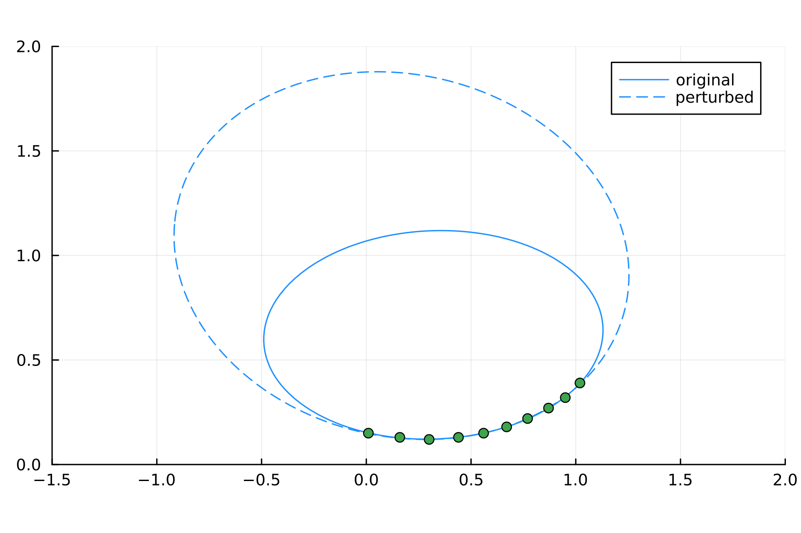

# Homework 4

## Chapter 3 Problem 5

### (a)

original problem: $(-2.6356254837120225, 0.14364618259886208, 0.5514469631403638, 3.2229403381058885, -0.43289427026445093)$

### (b)
perturbed problem: $(-1.5251827163512501, -0.2629039465937888, 0.5987523594059835, 3.092454476193479, -0.42975577238380336)$

Why ill-conditioned? Observed points are concentrated on a small region of the ellipse, as presented below:

## Chapter 3 Problem 11

See `3_11.jl`.

## Chapter 4 Problem 1

### (a)

Two eigenvalues: $\lambda_0, \lambda_1 = 0, 2$, and the correspondin eigenvectors are $\xi_0 = (1000, -1)$, and $\xi_1 = (1000, 1)$.

### (b)

$\kappa([\xi_0 \ \xi_1]) = 1000$.

### (c)

$\lambda = 1$. The $0.001$ perturbation for the $(2,1)$ entry of the matrix $B$ results in the $1$ perturbation in the eigenvalues.

